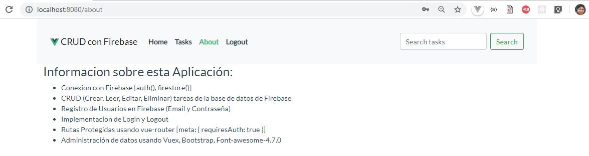

# vuexcrudtaskwithfirebase.djara.dev

# Aplicación realizando un CRUD con Firebase usando Vuex

## Descripcion

```
En esta aplicacion, se realizan practicas uzando vuex para el control de estados en Vue.
Ademas establecemos una conexion con la Base de datos en Firebase.

Detalle de la Aplicación:
    1.- Login con usuario y clave usando las cuentas de usuario de firebase.
    2.- CRUD de tareas relacionadas por cada usuario logueado.
    3.- Filtro de tareas.
    4.- Spinner mostrado en la carga de los archivos.
    5.- Mostrar y ocultar rutas para usuarios logueados.

Para el desarrollo de la aplicación se ha tomado como referencia las siguientes tecnologias:
    1. bootstrap
    2. font-awesome-4.7.0
    3. Firebase
    4. Vue, vue-router y vuex (store) usando Componentes
```

## Frontend de la Aplicacion




### Compila y recarga los archivos en modo Desarrollo

```
npm run serve
```

### Compila y Minimiza los archivos para el despliegue de Producción

```
npm run build
```

### Configuración Personalizada

[Ver Configuración](https://cli.vuejs.org/config/).
